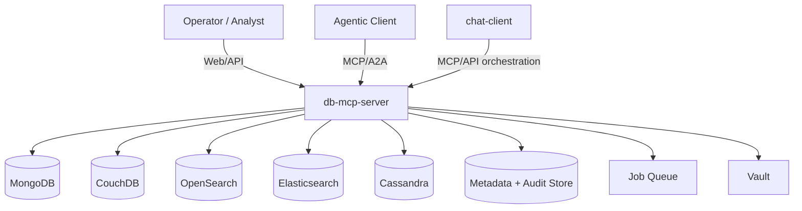
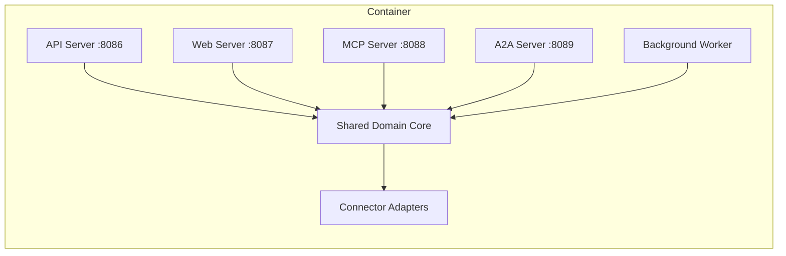
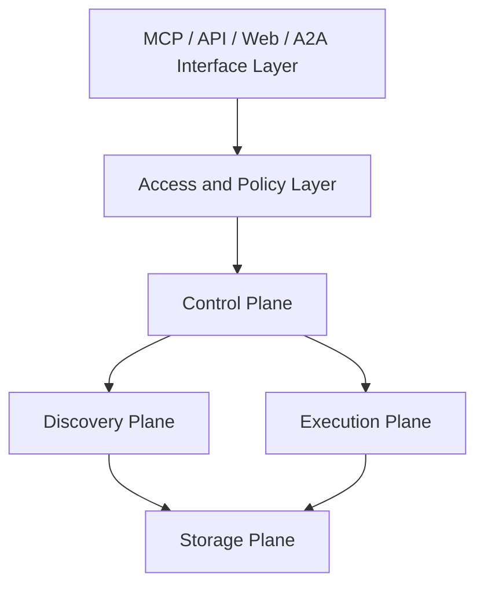
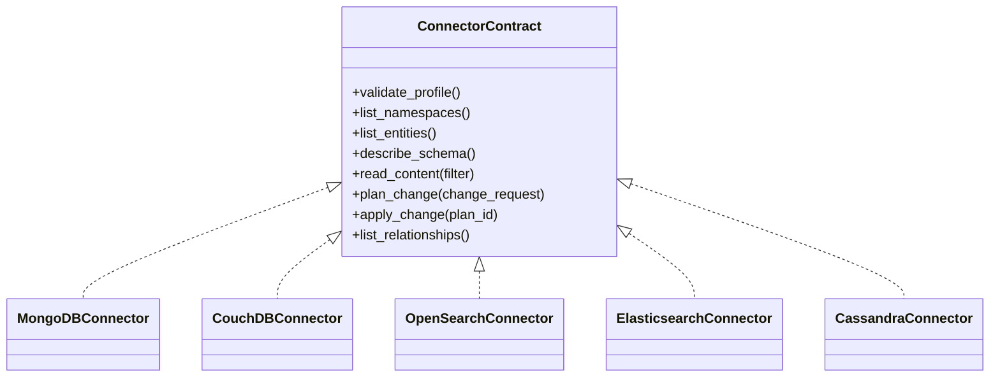
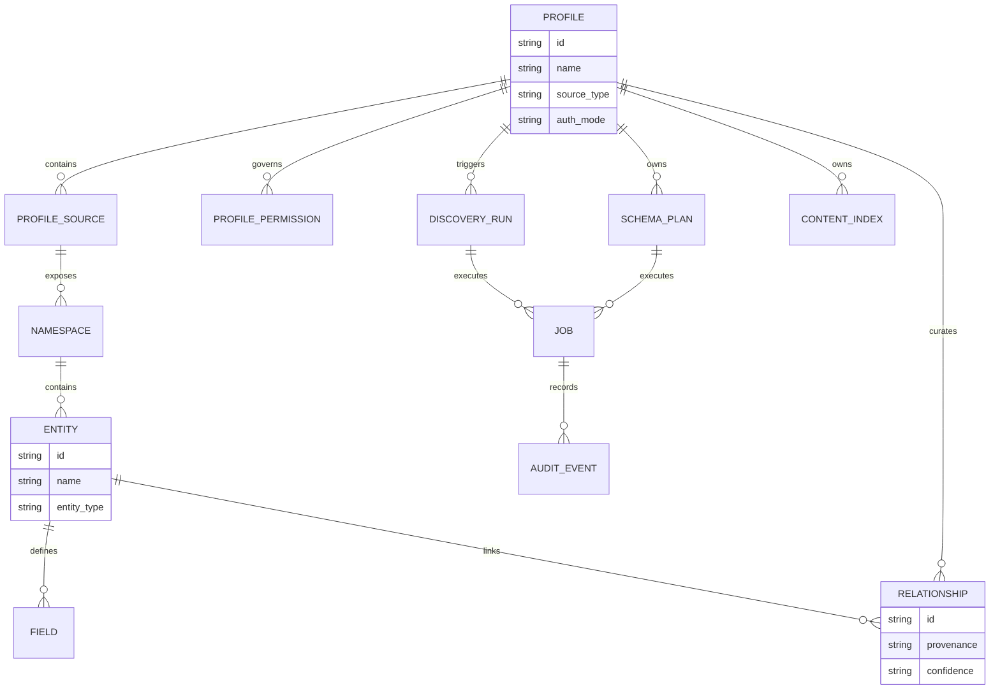
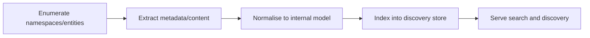
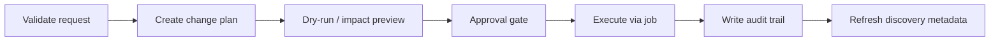

# db-mcp-server — Architecture

## W28A-421 Review Status
- Reviewed for external/shareable publication during W28A-421.
- Source basis: `defaults.yaml`, 4 server source files, 31 discovered routes/endpoints, and 46 MCP tools.
- Internal-only absolute paths, environment-specific hosts, and private registries have been removed from this shareable document set.

## 1. System Context
`db-mcp-server` is planned as the Cloud-Dog AI service for discovery, controlled operations, schema planning, relationship management, and indexed exploration across NoSQL and search platforms. It serves human operators, internal agents, and higher-level orchestration clients through REST, Web, MCP, and A2A surfaces while enforcing profile-scoped RBAC and audit.

## 2. Container Diagram
The planned runtime is one logical all-in-one deployment containing four front-door servers, a background worker, and connector adapters.

## 3. Component Diagram
The planned system follows six logical layers from the Phase 1 brief.

## 4. Connector Architecture
Each source uses one adapter package under `src/core/connectors/<source>/` implementing a common contract.

## 5. Data Model
The metadata store tracks connection profiles, sources, discovered objects, relationship metadata, jobs, and audit events.

## 6. MCP Tool Surface
Planned tools are grouped by family rather than listed as a flat unstructured set.

- Profile tools: `profile_list`, `profile_get`, `profile_create`, `profile_update`, `profile_delete`, `profile_validate`
- Discovery tools: `namespace_list`, `entity_list`, `field_list`, `index_list`, `capability_get`
- Schema tools: `schema_describe`, `schema_diff`, `schema_plan`, `schema_apply`, `schema_job_status`
- Content tools: `content_read`, `content_create`, `content_update`, `content_delete`, `content_bulk_plan`
- Search tools: `search_metadata`, `search_content`, `search_explain`, `index_refresh`, `index_status`
- Relationship tools: `relationship_list`, `relationship_create`, `relationship_update`, `relationship_delete`, `relationship_infer_candidates`
- Audit and job tools: `job_list`, `job_get`, `job_wait`, `audit_list`, `audit_get`

## 7. Indexing Pipeline
Discovery and content indexing are planned as staged jobs.

## 8. Schema Change Workflow
Schema changes are never executed directly from free-text. They follow a gated plan/apply flow.

## 9. Relationship Lifecycle
Relationships may be declared explicitly, inferred, or curated.

## 10. Security Model
- Users, groups, API keys, and RBAC come from `cloud_dog_idam`
- Profiles scope all connector access
- Field masking is enforced in the service layer
- Audit is mandatory for discovery, read, write, schema, and relationship actions
- Structured filters are validated before execution

## 11. Deployment
- Standard four-server all-in-one container pattern
- Background worker in same deployment unit for Phase 1 simplicity
- Metadata/audit store via `cloud_dog_db`
- Connector credentials resolved by `cloud_dog_config` from env/Vault
- Preprod overlay documented in `docs/PREPROD.md`

## 12. Dependencies
### Platform packages
- `cloud_dog_config`
- `cloud_dog_logging`
- `cloud_dog_api_kit`
- `cloud_dog_idam`
- `cloud_dog_jobs`
- `cloud_dog_db`

### External sources
- MongoDB
- CouchDB
- OpenSearch
- Elasticsearch
- Cassandra

### Design constraints
- Structured filters replace LLM-generated executable queries
- Connector isolation is mandatory
- Plan/apply/audit is mandatory for schema mutations
